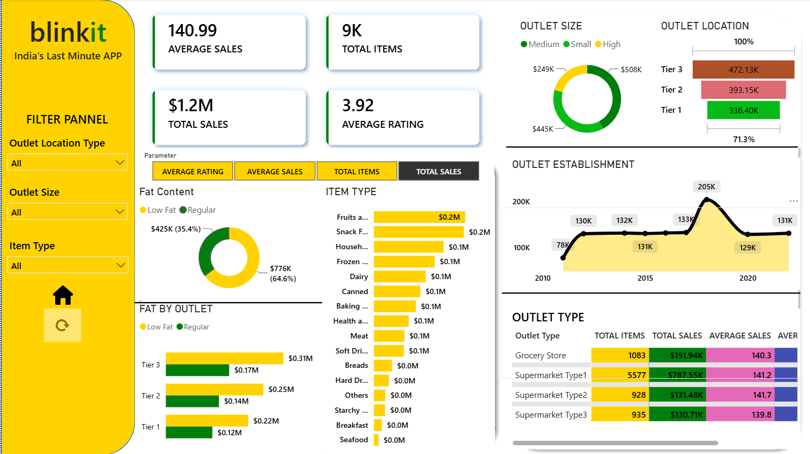

# Blinkit Sales Analysis Dashboard
Power BI dashboard build to analysze Blinkit sales performance, outlet  performance, product categories,  customer insights.

## Project Overview
This project uses Power BI to analyze Blinkit sales data and identify key business insights across sales, products, outlets, and customer behavior.

## Tools & Technologies

- Power BI
- DAX
- Power Query
- Data Visualization
- Data Cleaning
- Data Analysis

## Key KPIs

- Average Sales: 140.99
- Total Items Sold: 9K
- Total Sales: $1.2M
- Average Rating: 3.92

## Business Questions

- What is the overall sales performance?
- Which outlet locations generate the highest sales?
- How does outlet size affect sales performance?
- Which outlet types contribute the most to total sales?
- Which item categories generate the highest sales?
- How has outlet performance changed over time?

## Business Insights

- Tier 3 outlets generated the highest total sales.
- Medium-sized outlets contributed a significant share of total sales.
- Grocery Stores generated the highest sales among outlet types.
- Fruits and Vegetables were among the highest-selling item categories.
- Outlet establishment trends show changes in sales performance over time.

## Dashboard Preview

